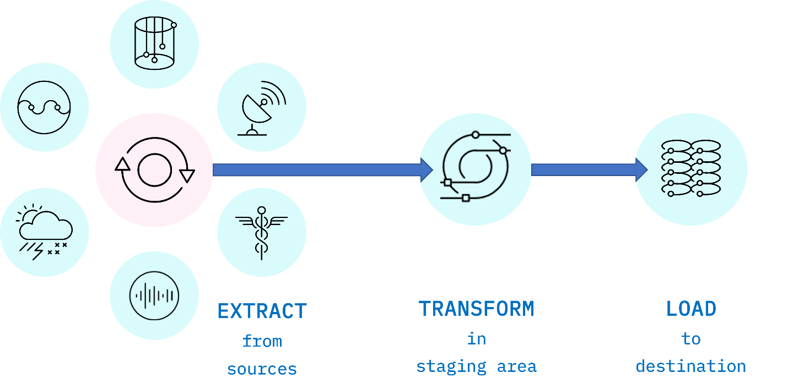
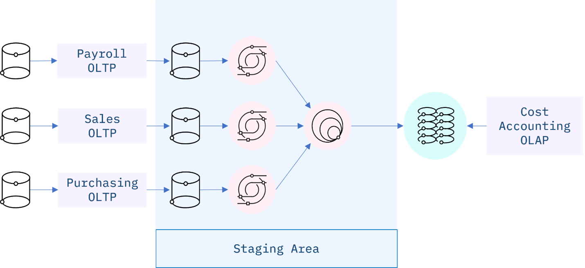

# Introduction to Data Pipelines

## What is a Data Pipeline?

A data pipeline is a series of data processing steps that orchestrate the movement of data from one system to another. It enables organizations to reliably extract data from various sources, transform it to fit operational needs, and load it into target systems for analysis, visualization, or further processing.

## The ETL Process

### What is Extraction?

Extraction is the process of retrieving data from various sources, which can include databases, files, APIs, or other data repositories. The goal of extraction is to gather the necessary data that will be transformed and loaded into a target environment for downstream use cases like ML, dashboards, or reporting.

This includes configuring access to data sources, writing queries or scripts to pull the data -> web scraping, API calls, or reading files - maybe static files or streaming data.

#### Raw Data Sources:

1. Archived files (CSV, JSON, XML)
2. Relational databases (MySQL, PostgreSQL, Oracle)
3. NoSQL databases (MongoDB, Cassandra)
4. APIs (REST, GraphQL)
5. Streaming data (Kafka, AWS Kinesis)

#### Extraction Methods:

- **Full Extraction**: Extracting the entire dataset each time
- **Incremental Extraction**: Extracting only new or modified data since the last extraction
- **Logical Extraction**: Extracting data based on logical conditions
- **Physical Extraction**: Direct extraction from physical storage

#### Extraction Tools:

- **Apache NiFi**: For data ingestion from various sources
- **Fivetran**: Automated data pipeline tool for SaaS applications
- **Airbyte**: Open-source data integration platform
- **Custom Scripts**: Python/SQL scripts for specific extraction needs

### What is Transformation?

Transformation is the process of converting extracted data into a format suitable for analysis or storage. This can involve cleaning the data (removing duplicates, handling missing values), aggregating it (summarizing data), or reshaping it (pivoting tables, changing data types). The goal is to prepare the data so that it meets the requirements of the target system or application.

Transformations decrease the data volume - which may lead to information loss (reducing sampling rate, aggregating data, etc.).

#### Transformation Operations:

1. **Data Cleaning**: Removing duplicates, handling missing values, and correcting errors, data typing (cast into correct types), conversion (json to csv), filtering, normalization, standardization and leveling.
2. **Data Aggregation**: Joining, Feature engineering, Summarizing data, calculating averages, totals, or other statistics.
3. **Data Reshaping**: Pivoting tables, changing data types, and restructuring data to fit the target schema.
4. **Data Enrichment**: Adding additional information from other sources
5. **Data Validation**: Ensuring data meets quality standards
6. **Data Standardization**: Converting to consistent formats (dates, currencies, etc.)

#### Transformation Tools:

- **Apache Spark**: For large-scale data processing
- **dbt (data build tool)**: SQL-first transformation tool
- **Pandas**: Python library for data manipulation
- **Azure Data Factory**: Cloud-based data integration service
- **AWS Glue**: Serverless ETL service

### What is Loading?

Loading is the final step in the ETL process, where the transformed data is written to a target system, such as a data warehouse, database, or data lake. The goal of loading is to make the data available for analysis, reporting, or other downstream applications. This can involve inserting new records, updating existing ones, or overwriting data in the target system.

#### Loading Methods:

Complete loading is done when you want to replace the entire dataset in the target system, while incremental loading is used to update only the new or changed data. Incremental loading is subdivided into batch loading, stream loading.

- **Batch Loading**: Loading data in scheduled batches (periodic loading - daily updates, hourly updates, scheduled by linux cron jobs . windows task scheduler.)
- **Stream Loading**: Continuous loading of data as it arrives (continuous, real-time and event-triggered.)
- **Bulk Loading**: High-performance loading of large datasets
- **Incremental Loading**: Loading only new or changed data

Push vs Pull data loading methodology - Client-server / publisher-subscriber architecture.
Serial vs Parallel loading - Serial loading is done sequentially, while parallel loading processes (chunking) multiple data streams simultaneously to improve performance. Analogy to Dataloaders in PyTorch.

#### Loading Considerations:

- **Data Integrity**: Ensuring data is loaded correctly and completely
- **Performance**: Optimizing loading for speed and efficiency
- **Failure Handling**: Managing and recovering from loading failures
- **Scheduling**: Determining when to load data

## Data Storage Systems

### OLTP vs OLAP Systems

#### OLTP - Online Transaction Processing

OLTP systems are designed for managing transaction-oriented applications. They are optimized for high transaction throughput and low latency, making them suitable for day-to-day operations of businesses. OLTP databases typically handle a large number of short online transactions, such as order entry, financial transactions, and customer relationship management.

**Characteristics:**

- Write-intensive workloads
- CRUD (Create, Read, Update, Delete) operations
- Highly normalized schema for data integrity
- Row-oriented storage
- Small, simple transactions
- High concurrency

**Real-world Examples:**

- Banking transaction systems (e.g., ATM withdrawals, fund transfers)
- E-commerce platforms (e.g., Amazon's order processing)
- Airline reservation systems (e.g., booking flights)
- CRM systems (e.g., Salesforce for customer interactions)
- ERP systems (e.g., SAP for enterprise resource planning)

**Common OLTP Databases:**

- MySQL
- PostgreSQL
- Microsoft SQL Server
- Oracle Database
- IBM Db2

#### OLAP - Online Analytical Processing

OLAP systems are designed for complex queries and data analysis. They are optimized for read-heavy workloads, allowing users to perform multidimensional analysis of business data. OLAP databases typically handle large volumes of historical data and support complex aggregations, calculations, and reporting.

**Characteristics:**

- Read-intensive workloads
- Complex, aggregation-heavy queries
- Denormalized schema for query performance
- Column-oriented storage
- Large, complex operations
- Lower concurrency requirements

**Real-world Examples:**

- Business intelligence dashboards (e.g., Power BI reports analyzing sales trends)
- Financial analysis systems (e.g., quarterly financial reporting)
- Customer segmentation analysis (e.g., identifying high-value customer groups)
- Supply chain optimization (e.g., analyzing inventory patterns)
- Marketing campaign effectiveness analysis

**Common OLAP Solutions:**

- Snowflake
- Google BigQuery
- Amazon Redshift
- Microsoft Azure Synapse
- Apache Druid

#### OLTP vs OLAP Comparison Table

| Feature          | OLTP                         | OLAP                                     |
| ---------------- | ---------------------------- | ---------------------------------------- |
| Primary Purpose  | Daily transaction processing | Data analysis and reporting              |
| Data Source      | Operational data             | Consolidated data from different sources |
| Data Age         | Current, real-time data      | Historical data                          |
| Schema Design    | Normalized (3NF)             | Denormalized (Star/Snowflake)            |
| Query Complexity | Simple, predefined           | Complex, ad-hoc                          |
| Processing Speed | Milliseconds to seconds      | Seconds to minutes                       |
| Storage Volume   | Gigabytes                    | Terabytes to Petabytes                   |
| Backup/Recovery  | Critical, frequent           | Less critical, less frequent             |
| User Type        | Operational staff, customers | Analysts, executives, data scientists    |
| Optimization For | Write performance            | Read performance                         |

### Data Warehouses, Data Lakes, and Data Marts

#### Data Warehouse

A data warehouse is a centralized repository that stores structured, processed data from various sources for the purpose of business intelligence, reporting, and analysis. Data warehouses are designed to support analytical queries and are typically optimized for read operations.

**Characteristics:**

- Structured data (schema-on-write)
- Subject-oriented organization
- Integrated from multiple sources
- Time-variant (historical data)
- Non-volatile (stable, read-mostly)

**Examples:**

- Amazon Redshift
- Snowflake
- Google BigQuery
- Microsoft Azure Synapse
- Teradata

#### Data Lake

A data lake is a modern self-serve data storage solution that allows for the storage of structured, semi-structured, and unstructured data at scale. Data lakes are designed to handle large volumes of data and provide flexibility in terms of data ingestion and processing. They support various data formats and can be used for advanced analytics, machine learning, and real-time processing.

**Characteristics:**

- Raw, unprocessed data (schema-on-read)
- Flexible schema
- Supports all data types
- Massive scalability
- Cost-effective storage

**Examples:**

- Amazon S3
- Azure Data Lake Storage
- Google Cloud Storage
- Databricks Delta Lake
- Hadoop HDFS

#### Data Mart

A data mart is a subset of a data warehouse focused on a specific business line, department, or subject area. Data marts are designed to provide specialized and relevant data for specific business users, making it easier for them to access and analyze the data they need.

**Characteristics:**

- Subject-specific
- Smaller in size than data warehouses
- Faster query performance
- Department-focused
- Often built from a data warehouse

**Examples:**

- Finance data mart
- Marketing data mart
- Sales data mart
- HR data mart
- Customer service data mart

## ETL vs ELT Methodologies

ETL (Extract, Transform, Load) and ELT (Extract, Load, Transform) are two different approaches to data integration and processing.

### ETL (Extract, Transform, Load)

In ETL, data is extracted from source systems, transformed into a suitable format, and then loaded into a target system. The transformation step is performed before loading the data, which means that the data is cleaned, aggregated, and reshaped before it is stored in the target system.

schema-on-write approach: Schema is defined before loading into the target system, ensuring that data adheres to a predefined structure. To have the data consistent and efficieient for optimized downstream queries.

ETL may have information loss due to transformations.

**Characteristics:**

- Transformations occur in a dedicated transformation engine
- Optimized for structured data
- Better for compliance and data privacy (sensitive data can be filtered before loading)
- Traditionally used with on-premises data warehouses
- Transformations are predefined and rigid

**Use Cases:**

- When data requires significant cleaning before loading
- When working with limited computing resources
- When data privacy is a major concern
- For structured data with predictable schemas
- Legacy systems integration

**Tools:**

- Informatica PowerCenter
- Talend
- Microsoft SSIS
- IBM DataStage
- Oracle Data Integrator

### ELT (Extract, Load, Transform)

While transformations are basic in ETL, they can be more complex, dynamic and flexible in ELT. In ELT, data is extracted from source systems, loaded into the target system, and then transformed within the target system. This allows for more complex transformations and processing to be performed on the data after it has been loaded, leveraging the computational power of modern data platforms.

schema-on-read approach: Data is loaded in its raw form, and the schema is applied when the data is read or queried. This allows for greater flexibility in how data is structured and used.

ELT does not have information loss due to transformations, as raw data is preserved.

**Characteristics:**

- Transformations occur within the target system
- Better suited for large volumes of data
- More flexible transformation approach (transform as needed)
- Takes advantage of cloud scalability
- Enables self-service data transformation

**Use Cases:**

- Big data processing scenarios
- Cloud-based data platforms
- When raw data access is valuable
- When transformation requirements change frequently
- Advanced analytics and machine learning pipelines

**Tools:**

- Snowflake
- Google BigQuery
- Amazon Redshift Spectrum
- dbt (data build tool)
- Apache Spark on Databricks

### Detailed Comparison: ETL vs ELT

| Aspect                        | ETL                                                  | ELT                                                                   |
| ----------------------------- | ---------------------------------------------------- | --------------------------------------------------------------------- |
| **Processing Order**          | Extract → Transform → Load                           | Extract → Load → Transform                                            |
| **Time to Insight**           | Longer - data must be transformed before analysis    | Shorter - raw data available immediately, transform as needed         |
| **Big Data Support**          | Limited - transformation layer can become bottleneck | Excellent - leverages target system's processing power                |
| **Flexibility**               | Less flexible - transformations are predefined       | More flexible - transformations can be defined and modified on demand |
| **Scalability**               | Limited by transformation layer                      | High - leverages cloud computing resources                            |
| **Transformation Complexity** | Limited by ETL tool capabilities                     | Supports complex transformations using SQL, Python, etc.              |
| **Storage Requirements**      | Lower - only transformed data is stored              | Higher - both raw and transformed data are stored                     |
| **Data Governance**           | Easier to implement at transform stage               | More challenging, requires governance on raw data                     |
| **Best For**                  | Structured data, predefined use cases                | Big data, evolving use cases, exploratory analysis                    |
| **Cost Model**                | Higher upfront cost, lower storage cost              | Lower upfront cost, higher storage cost                               |

ELT is a natural evolution of ETL, particularly suited for cloud environments. The key differences include:

**Staging Area Approach:**
In ETL, a staging area is used temporarily during the transformation process.
In ELT, the data lake or warehouse itself serves as the staging area, where raw data resides permanently.

**Parallel Processing:**
Extraction and loading in ELT are often done in parallel and asynchronously, especially for large volumes of data. This is possible because you can scale up compute resources on-demand in cloud environments, as compared to on-premise systems where scaling storage and compute separately is more challenging.

**Transformation Timing:**
In ELT, transformation happens after the data is loaded (on-demand and as needed, real-time, ad-hoc), decoupling the transformation process from the extraction and loading steps. This allows for more agility, versatility, and flexibility in how data is transformed and processed, as well as the ability to leverage the computational power of modern data platforms.

## ETL Techniques and Workflows

ETL stands for Extract, Transform, and Load, and refers to the process of curating data from multiple sources, conforming it to a unified data format or structure, and loading the transformed data into its new environment.

### ETL Processes in Detail

**Extract:**
Data extraction is the first stage of the ETL process, where data is acquired from various source systems. The data may be completely raw, such as sensor data from IoT devices, or perhaps it is unstructured data from scanned medical documents or company emails. It may be streaming data coming from a social media network or near real-time stock market buy/sell transactions, or it may come from existing enterprise databases and data warehouses.

**Transform:**
The transformation stage is where rules and processes are applied to the data to prepare it for loading into the target system. This is normally done in an intermediate working environment called a "staging area." Here, the data are cleaned to ensure reliability and conformed to ensure compatibility with the target system.

Many other transformations may be applied, including:

- **Cleaning:** Fixing any errors or missing values
- **Filtering:** Selecting only what is needed
- **Joining:** Merging disparate data sources
- **Normalizing:** Converting data to common units
- **Data Structuring:** Converting one data format to another, such as JSON, XML, or CSV to database tables
- **Feature Engineering:** Creating KPIs for dashboards or machine learning
- **Anonymizing and Encrypting:** Ensuring privacy and security
- **Sorting:** Ordering the data to improve search performance
- **Aggregating:** Summarizing granular data

**Load:**
The load phase is all about writing the transformed data to a target system. The system can be as simple as a comma-separated file, which is essentially just a table of data like an Excel spreadsheet. The target can also be a database, which may be part of a much more elaborate system, such as a data warehouse, a data mart, data lake, or some other unified, centralized data store forming the basis for analysis, modeling, and data-driven decision making by business analysts, managers, executives, data scientists, and users at all levels of the enterprise.

In most cases, as data is being loaded into a database, the constraints defined by its schema must be satisfied for the workflow to run successfully. The schema, a set of rules called integrity constraints, includes rules such as uniqueness, referential integrity, and mandatory fields. Thus such requirements imposed on the loading phase help ensure overall data quality.

### ETL Workflows as Data Pipelines

Generally, an ETL workflow is a well thought out process that is carefully engineered to meet technical and end-user requirements.

Traditionally, the overall accuracy of the ETL workflow has been a more important requirement than speed, although efficiency is usually an important factor in minimizing resource costs. To boost efficiency, data is fed through a data pipeline in smaller packets. While one packet is being extracted, an earlier packet is being transformed, and another is being loaded. In this way, data can keep moving through the workflow without interruption. Any remaining bottlenecks within the pipeline can often be handled by parallelizing slower tasks.

With conventional ETL pipelines, data is processed in batches, usually on a repeating schedule that ranges from hours to days apart. For example, records accumulating in an Online Transaction Processing System (OLTP) can be moved as a daily batch process to one or more Online Analytics Processing (OLAP) systems where subsequent analysis of large volumes of historical data is carried out.

Batch processing intervals need not be periodic and can be triggered by events, such as:

- When the source data reaches a certain size
- When an event of interest occurs and is detected by a system, such as an intruder alert
- On-demand, with web apps such as music or video streaming services

### Staging Areas

ETL pipelines are frequently used to integrate data from disparate and usually siloed systems within the enterprise. These systems can be from different vendors, locations, and divisions of the company, which can add significant operational complexity. As an example, a cost accounting OLAP system might retrieve data from distinct OLTP systems utilized by the separate payroll, sales, and purchasing departments.

The staging area is used to manage change detection of new or modified data from the source systems, data updates, and any transformations required to conform and integrate the data prior to loading to the OLAP.

### ETL Workflows as DAGs

ETL workflows can involve considerable complexity. By breaking down the details of the workflow into individual tasks and dependencies between those tasks, one can gain better control over that complexity. Workflow orchestration tools such as Apache Airflow do just that.

Airflow represents your workflow as a directed acyclic graph (DAG). Airflow tasks can be expressed using predefined templates, called operators. Popular operators include Bash operators, for running Bash code, and Python operators for running Python code, which makes them extremely versatile for deploying ETL pipelines and many other kinds of workflows into production.

### Popular ETL Tools

There are many ETL tools available today. Modern enterprise grade ETL tools will typically include the following features:

- **Automation:** Fully automated pipelines
- **Ease of use:** ETL rule recommendations
- **Drag-and-drop interface:** "No-code" rules and data flows
- **Transformation support:** Assistance with complex calculations
- **Security and Compliance:** Data encryption and HIPAA, GDPR compliance

Some well-known ETL tools include:

**Talend Open Studio**

- Supports big data, data warehousing, and profiling
- Includes collaboration, monitoring, and scheduling
- Drag-and-drop GUI for ETL pipeline creation
- Automatically generates Java code
- Integrates with many data warehouses
- Open-source

**AWS Glue**

- ETL service that simplifies data prep for analytics
- Suggests schemas for storing your data
- Create ETL jobs from the AWS Console

**IBM InfoSphere DataStage**

- A data integration tool for designing, developing, and running ETL and ELT jobs
- The data integration component of IBM InfoSphere Information Server
- Drag-and-drop graphical interface
- Uses parallel processing and enterprise connectivity in a highly scalable platform

**Alteryx**

- Self-service data analytics platform
- Drag-and-drop accessibility to ETL tools
- No SQL or coding required to create pipelines

**Apache Airflow and Python**

- Versatile "configuration as code" data pipeline platform
- Open-sourced by Airbnb
- Programmatically author, schedule, and monitor workflows
- Scales to Big Data
- Integrates with cloud platforms

**The Pandas Python Library**

- Versatile and popular open-source programming tool
- Based on data frames – table-like structures
- Great for ETL, data exploration, and prototyping
- Doesn't readily scale to Big Data

## Performance Characteristics of Data Pipelines

### Throughput

- **Definition**: Amount of data processed per unit time
- **Optimization**: Parallel processing, efficient algorithms, hardware acceleration
- **Measurement**: Records/second, MB/second, GB/hour

### Latency

- **Definition**: Time delay between data creation and availability for use
- **Types**:
  - Batch latency (hours/days)
  - Near real-time (minutes)
  - Real-time (seconds/milliseconds)
- **Tradeoffs**: Lower latency typically requires more resources

### Scalability

- **Vertical Scaling**: Adding more power to existing resources
- **Horizontal Scaling**: Adding more machines to the resource pool
- **Auto-scaling**: Dynamically adjusting resources based on workload

### Reliability

- **Fault Tolerance**: Ability to continue operating despite failures
- **Redundancy**: Duplicate components to prevent single points of failure
- **Monitoring**: Detecting and resolving issues before they impact operations

### Resource Utilization

- **CPU/Memory Usage**: Efficient use of computing resources
- **I/O Operations**: Minimizing disk and network bottlenecks
- **Cost Efficiency**: Balancing performance with operational costs

## Real-World Examples of Data Pipeline Implementations

### Example 1: E-commerce Analytics Pipeline

**Business Context:**
An e-commerce company needs to analyze customer behavior, sales performance, and inventory management to optimize operations and improve customer experience.

**Pipeline Architecture:**

1. **Data Sources**:

   - Transactional database (MySQL) - customer orders, product information
   - Web/mobile app logs (Clickstream data)
   - Inventory management system (PostgreSQL)
   - Customer support system (Zendesk)

2. **Extraction Layer**:

   - Batch extraction from MySQL and PostgreSQL using AWS DMS
   - Real-time log ingestion using Kafka for clickstream data
   - API-based extraction from Zendesk using custom Python scripts

3. **Loading Strategy**:

   - Raw data loaded into Amazon S3 data lake (ELT approach)
   - Partitioning by date and data source

4. **Transformation Layer**:

   - AWS Glue for catalog and metadata management
   - Spark on EMR for heavy transformations
   - dbt for SQL transformations and modeling

5. **Serving Layer**:
   - Transformed data loaded to Amazon Redshift for BI tools
   - Specialized aggregates stored in DynamoDB for real-time dashboards
   - ML features exported to S3 for model training

**Engineering Choices and Rationale:**

1. **Why ELT instead of ETL?**

   - The company has unpredictable analytical needs that evolve quickly
   - Data scientists need access to raw data for exploratory analysis
   - Cloud economics make storing raw data cost-effective
   - The scale of clickstream data makes pre-transformation challenging

2. **Why a hybrid batch/streaming approach?**

   - Order and inventory data has natural daily batch windows
   - User behavior analytics benefit from real-time insights
   - Cost optimization by using the right tool for each data type

3. **Performance Considerations:**
   - Partitioning strategy optimized for typical query patterns
   - Redshift distribution keys set based on join patterns
   - Aggressive caching for dashboards and frequent queries
   - Data retention policies balance analytical needs with storage costs

### Example 2: Financial Services Data Platform

**Business Context:**
A financial services company needs to process transactions, detect fraud, comply with regulations, and provide reporting for both internal analysts and regulatory agencies.

**Pipeline Architecture:**

1. **Data Sources**:

   - Core banking system (IBM Db2)
   - Payment processing systems (multiple vendors)
   - Customer relationship management (Salesforce)
   - Market data feeds (Bloomberg, Reuters)
   - Compliance and risk management systems

2. **Extraction Strategy**:

   - Change Data Capture (CDC) for transactional databases
   - API integration for SaaS platforms
   - File-based ingestion for batch reports and reference data

3. **Processing Approach**:

   - Traditional ETL for sensitive customer data (using Informatica)
   - ELT for market data and analytical workloads
   - Real-time stream processing for fraud detection (Kafka + Flink)

4. **Storage Architecture**:

   - Data warehouse (Snowflake) for structured reporting
   - Data lake (Azure Data Lake Storage) for raw and semi-structured data
   - Specialized data marts for regulatory reporting

5. **Security and Governance**:
   - Column-level encryption for PII data
   - Comprehensive data lineage tracking
   - Automated data quality checks and alerting

**Engineering Choices and Rationale:**

1. **Why a hybrid ETL/ELT approach?**

   - ETL for sensitive data allows for masking and anonymization before storage
   - Regulatory requirements mandate certain transformations at ingestion time
   - ELT for analytical workloads provides flexibility for evolving business questions
   - The company can leverage existing ETL investments while modernizing gradually

2. **Why separate stream processing for fraud detection?**

   - Millisecond-level latency requirements for fraud detection
   - Pattern recognition algorithms need real-time data correlation
   - Separate fraud pipeline ensures core reporting isn't affected by fraud detection overhead

3. **Performance and Scalability Considerations:**

   - Multi-region deployment for disaster recovery
   - Workload isolation between operational and analytical queries
   - Dynamic scaling based on market volatility and month-end processing needs
   - Prioritization framework for competing resource demands

4. **Compliance Factors:**
   - Immutable audit trails for all data transformations
   - Built-in data retention and purging based on regulatory requirements
   - Automated compliance reporting with validation checks
   - Region-specific data residency enforcement

This hybrid approach reflects the reality of financial services organizations, where legacy systems, strict regulations, and real-time requirements must all be balanced in a comprehensive data strategy.
